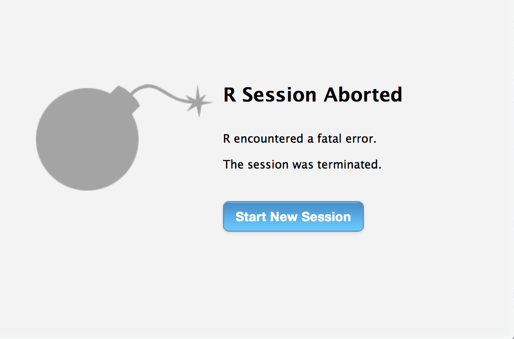

<!-- README.md is generated from README.Rmd. Please edit that file -->
TestWithRStudio for Testing your R Package with RStudio in Continuous Integration
=================================================================================

[](https://travis-ci.org/Non-Contradiction/TestWithRStudio) [](https://ci.appveyor.com/project/Non-Contradiction/TestWithRStudio)

Why do we need TestWithRStudio?
-------------------------------

<table>
<colgroup>
<col width="51%" />
<col width="48%" />
</colgroup>
<thead>
<tr class="header">
<th>Oh, no!!!!!</th>
<th>What's wrong this time!!</th>
</tr>
</thead>
<tbody>
<tr class="odd">
<td></td>
<td>As an R package developer, have you met the situation that your package passes <code>R CMD check</code> but crashes RStudio? <code>TestWithRStudio</code> can help you deal with this situation by testing your R package with RStudio using continuous integration like Travis CI.</td>
</tr>
</tbody>
</table>

Installation
------------

You can get `TestWithRStudio` by

``` r
devtools::install_github("Non-Contradiction/TestWithRStudio")
```

Basic Usage
-----------

``` r
library(TestWithRStudio)

check_rstudio()
#> Start a new RStudio process with pid = 68568
#> The rsession has pid = 68578
#> [1] TRUE

detailed_check_in_rstudio("1")
#> Start a new RStudio process with pid = 68605
#> The rsession has pid = 68615
#> $crashed
#> [1] FALSE
#> 
#> $finished
#> [1] TRUE
#> 
#> $errmsg
#> character(0)

detailed_check_in_rstudio("q()")
#> Start a new RStudio process with pid = 68644
#> The rsession has pid = 68654
#> Warning: 运行命令'kill -s 0 68654 >/dev/null 2>/dev/null'的状态是1
#> $crashed
#> [1] TRUE
#> 
#> $finished
#> [1] FALSE
#> 
#> $errmsg
#> character(0)

detailed_check_in_rstudio("doesntexist()")
#> Start a new RStudio process with pid = 68682
#> The rsession has pid = 68692
#> $crashed
#> [1] FALSE
#> 
#> $finished
#> [1] FALSE
#> 
#> $errmsg
#> [1] "Error in doesntexist() : 没有\"doesntexist\"这个函数"
#> [2] ""

detailed_check_in_rstudio("library(TestWithRStudio); crash()")
#> Start a new RStudio process with pid = 68719
#> The rsession has pid = 68729
#> Warning: 运行命令'kill -s 0 68729 >/dev/null 2>/dev/null'的状态是1
#> $crashed
#> [1] TRUE
#> 
#> $finished
#> [1] FALSE
#> 
#> $errmsg
#> character(0)
```

TestWithRStudio for R Package Developers
----------------------------------------

Suggestion and Issue Reporting
------------------------------

`TestWithRStudio` is under active development now. Any suggestion or issue reporting is welcome! You may report it using the link: <https://github.com/Non-Contradiction/TestWithRStudio/issues/new>. Or email me at <lch34677@gmail.com> or <cxl508@psu.edu>.
